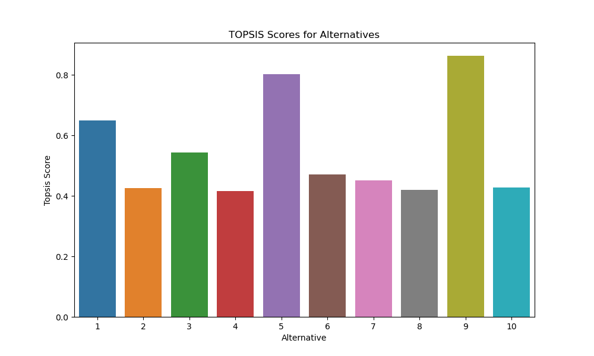

# TOPSIS Analysis with Python

## Description

### Input Data

A decision matrix named "model_metrics.csv" is read by the Python script. This matrix's columns correspond to numerous model-specific characteristics, including Accuracy, Training Time, and Model Size.

#### Models Used in the Analysis

The decision matrix includes the following models:

- BERT
- GPT-3
- XLNet
- RoBERTa
- DistilBERT
- ALBERT
- ERNIE
- ULMFiT
- FastText
- CLIP

### TOPSIS Analysis

The `topsis_analysis} function is used to carry out the TOPSIS analysis. Weights, effects, and the path of the input file are sent as arguments to the function.

- **Weights:** The weights are given as a string separated by commas, for example, "0.4,0.3,0.3".
- **Results:** A string of "+" and "-" symbols, representing the intended impact for each criterion, is used to specify the affects (e.g., "+,-,-").

The `topsis` function computes TOPSIS scores and ranks, finds positive and negative ideal solutions, normalises the decision matrix, and computes the weighted normalised decision matrix.

### Visualization

The Python script generates and saves a bar plot illustrating TOPSIS scores for each alternative. The plot is shown below:

